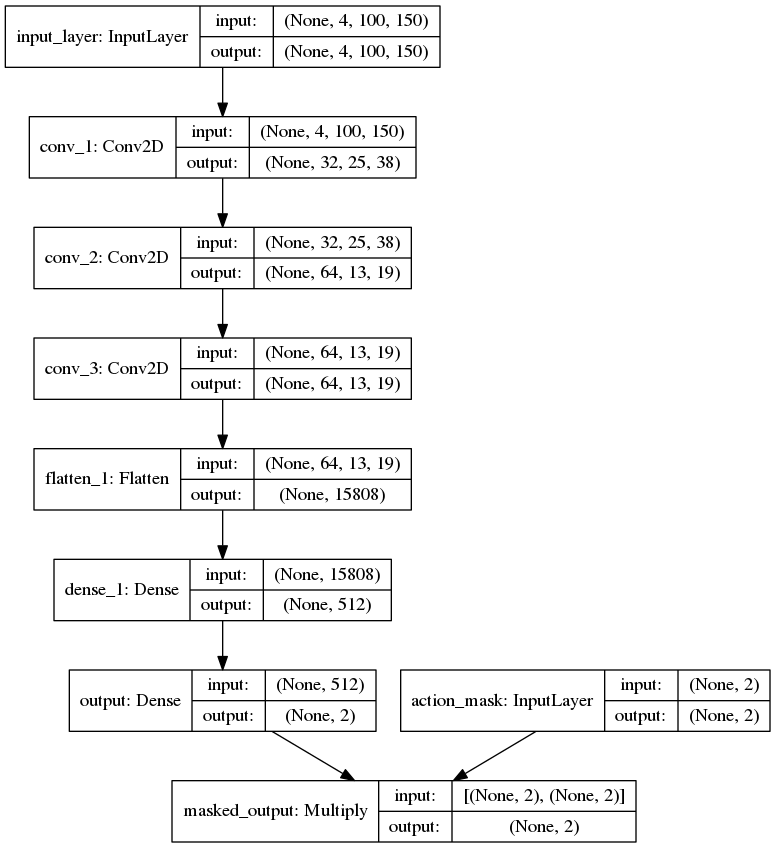

#                        Solving-openAI-Gym-MountainCarProblem-using-DQN-with-Image-input
I have targeted to solve a benchmark problem in Reinforcement learning literature using Deep Q-networks with images as the only input to the model. Keras was used to model the Convolutional neural network which predicts the best action to take in a given state. I was unable to find a comprehensive tutorial which implements the the DQN algorithm to solve the mountain car problem with images as the only input to the CNN model so came up with this with help from a lot of different tutorials to get my code working and will reference all of them below.

The file named _DQN_CNN_Complete.py_ is to train the model

The file named _test_DQN_CNN.py_ is to evaluate/test the trained model

The file named _plot_rewards.py_ is used to plot immediate episode rewards and average episode rewards saved in the _.dump_ files during training

## Problem setup
A car which starts at the bottom of the mountain has to climb up the mountain but doesn't have enough engine power to take it to the top without taking help from gravity. Therefore the car has to learn to go left and take help from gravity as well as its engine to reach its goal. The observation space is continous with position values ranging from -1.2 to 0.5. The action space is discreet and the car can either move left (1), do nothing (0) or move right (2).

## CNN model
The following is a graphical description of the CNN model 




Our model takes in two inputs; a stack of 4 gray scale images and an action mask. The action mask multiples with the output of our model. This encodes our Q-values in a one-hot style with the hot value corresponding to the action index.

```
        input_shape = (self.stack_depth, self.image_height, self.image_width)
        actions_input = layers.Input((self.num_actions,), name = 'action_mask')
```
Thus the input layer is defined as the size [None,4,100,150]. The None here signifies the unkown batch size we are going to
feed into our model.

 ```
        frames_input = layers.Input(input_shape, name='input_layer')
 ```
 
In my case I have set the image format in Keras backend as 'Channels first' (no particular reason)

```
        from keras import backend as K
        keras.backend.set_image_data_format('channels_first')
```

Next we define the core layers of our model exactly the same parameters as defined in the original DQN paper. I took help from this very nice tutorial to define my model and also use the action mask technique to vectorize my code (https://becominghuman.ai/lets-build-an-atari-ai-part-1-dqn-df57e8ff3b26)

```
        conv_1 = layers.Conv2D(32, (8,8), strides=4, padding ='same'\
        ,activation = 'relu', name='conv_1',kernel_initializer='glorot_uniform',bias_initializer='zeros')(frames_input)

        conv_2 = layers.Conv2D(64, (4,4), strides=2, padding='same', activation='relu',name='conv_2'\
           ,kernel_initializer='glorot_uniform',bias_initializer='zeros')(conv_1)

        conv_3 = layers.Conv2D(64, (3,3), strides=1, padding='same',name='conv_3', activation='relu'\
           ,kernel_initializer='glorot_uniform',bias_initializer='zeros')(conv_2)

        flatten_1 = layers.Flatten()(conv_3)

        dense_1 = layers.Dense(512, activation='relu', name='dense_1',
            kernel_initializer='glorot_uniform',bias_initializer='zeros')(flatten_1)
            
        output = layers.Dense(self.num_actions, activation='linear', name='output',
            kernel_initializer='glorot_uniform',bias_initializer='zeros')(dense_1)
```

The main model is followed by a multiplication layer which multiplies the input action mask with the model output. This has the effect of one hot encoding of the Q-values for all three actions. I am going to provide more explanation on this in the following sections.

```
        masked_output = layers.Multiply(name='masked_output')([output, actions_input])
```

We finally compile our model with the right optimizer, its learning rate and other parameters. I chose Huber loss but the model can be trained with mean square loss as well. In my case I tried to train with the RMSprop optimizer but I couldn't figure out the reason why my trained model failed to make good predictions although my training average trainig reward increased during traing. Using the Adam optimizer resulted in a high training and evaluation rewards. 

```
        model = Model(input = [frames_input, actions_input], output=[masked_output])
        optimizer = optimizers.Adam(lr = self.learning_rate)
        model.compile(optimizer,loss=tf.losses.huber_loss)
```

## Replay memory

The replay memory is initilized using the FIFO type deque memory from python collections library. We can define a maximum length for this memory type and once the memory is full, the oldest data samples are discarded from the other side as new samples are added. We use this memory to store experience samples as soon as they are generated. An experience sample includes the _state_ you start in, the _action_ (random or greedy) you take in that state, the _reward_ associated with this state action pair , the _next state_ you enter after taking the action, and the _done_ flag indicating if the _next state_ is a terminal state or not.

```     
        import collections
        
        self.memory = collections.deque(maxlen=200000)        
        def memorize(self, current_state, action, reward, next_state, done):     
                self.memory.append([current_state, action, reward, next_state, done])
```

## Processing input images

The processing applied to input images is very simple. I convert the RGB images to gray scale and scale them down by a factor of 4 resulting in a 150x100 image. The aspect ratio was kept constant while down scaling.

## Calculating targets

To calculate the TD targets for a given batch size, we first sample our reply memory randomly to get a batch of experience samples. This is followed by extracting each component of the experience sample using a for loop. I then cnormalize the image data (current states and next states). We could have normalized the images while processing the frames but normalized images are of type float32 while non noramalized ones are of type uint8. The latter takes up less memory when storing in the replay memory.

```
        def calculate_targets(self, batch_size):
        
                current_states = []
                rewards = []
                actions = []
                next_states = []
                dones = []

                samples = random.sample(self.memory, batch_size)
                for sample in samples:
                    state, action, reward, next_state, done = sample
                    current_states.append(state)
                    rewards.append(reward)
                    actions.append(action)
                    next_states.append(next_state)
                    dones.append(done)

                current_states = np.array(current_states)
                current_states = np.float32(np.true_divide(current_states,255))

                next_states = np.array(next_states)
                next_states = np.float32(np.true_divide(next_states,255))

```

Following the Bellman equation we have to calculate the TD targets as:


The Q-values of all the actions in the next state is calculated by passing the next state and an input mask of all ones to the target model. This mask allows us to output all the Q-values associated to the 3 actions in the next state. We need all three q-values because we will take the max value to deicide the next best action. The action mask is replicated to allow multiplication with all the q-values all the states in the training batch.

```
        action_mask = np.ones((1,self.num_actions))
        action_mask = np.repeat(action_mask, batch_size, axis=0)
        next_Q_values = self.target_model.predict([next_states, action_mask])
```

If the next state is a terminal state the q-values for all actions is set to zero. This will result in the TD target being equal the reward to reach that state from the previous state. In the mountain car problem this reward is zero. The total cumulative reward for the episode would then be the number of steps, with a negative sign, taken to complete the episode. Therefore, the goal is to complete the task in the least possible number of steps.

```
        next_Q_values[dones] = 0
        targets = rewards + self.discount_factor * np.max(next_Q_values, axis=1)
```     
At this stage we also calculate the one-hot action mask for our target values. This one hot value corresponds to the index of the action taken in the current state to take the car to the next state.

```
        action_mask_current = self.get_one_hot(actions)
```

And the one hot-function is given as:

```
        def get_one_hot(self,actions):

                actions = np.array(actions)
                one_hots = np.zeros((len(actions), self.num_actions))
                one_hots[:, 0][np.where(actions == 0)] = 1
                one_hots[:,1][np.where(actions == 1)] = 1
                one_hots[:, 2][np.where(actions == 2)] = 1
```     

## Train function

This function performs the actual model fitting or weight update. The current states, action mask and the targets (labels) for these states which are returned by _calculate_targets_ function are passed as inputs to the _fit_ function or _train_from_batch_ function of the keras API. The _fit_ function works by first predicting the output for a given state and then comparing these predictions against the provided labels to see how far was the model's estimate from the desired value. It then updates the model's weights to make sure the the next predicitons are closer to the desired value. This is where the action mask returned from the _calculate_targets_ function helps us.

Lets assume that an arbitrary sample contains the action to 'go left (0)' in one state to take it to the next state. Now in this next state the best action to take (the one with the max q-value) is to 'go right (2)'. How then will we calculate the Bellman error when you have to subtract two values located at different indices? The action mask that is generated is one hot corresponding to the index of the action that was originally taken in the current state. This mask when multiplied by the prediction of our learning model keeps only the q-value of the action taken and zeroes out the other values. This same mask when multiplied by targets[:,None] keeps the maxmium q-value of all three actions at the index corresponding to the same action that was taken earlier. This allows for a simple subtraction of the two terms to calculate the Bellman error in a vectorized way:


All of the above is handled by the keras _fit_ function which is implemented in my code as

```
        def train_from_experience(self, states, action_mask, targets ):

                labels = action_mask * targets[:, None]
                loss = self.model.train_on_batch([states, action_mask], labels)
```

## Saving the model 

Keras API provides a save method for each model object. This save method saves both the model architecture and its weights.
I use this function every 1000 episodes to save my model's weights for evaluation purposes although a better approach would be to save the model architecture only once and save the weights evrey certain number of frames or episodes. The second approach is also very easy to implement using keras.

## Main script

I start by initializing my Mountain car environment using the command _gym.make('MountainCar-v0').env_. The _env_ at the end allows me to remove any upper bounds on the number of allowed steps to complete each episode. If I do not use this, the number of allowed steps is fixed at 200. In my experience this many steps are not enough to train your model. The reason being that during the exploration stage when the car is taking random actions, it is very difficult for it to earn some rewards within 200 steps mainly because our reward is very sparse (only achieved upon reaching the goal). To train a model with 200 steps per episode my intuition is to modify the reward function so that the car gets some intermediate rewards during the episode or to change the exploration strategy such a way that the car is able to reach the terminal state at least a few ocassions within 200 steps.

Following this, an object of the CarAgent class is initialized

```             
        env = gym.make('MountainCar-v0').env
        agent = CarAgent(env)
```

Other parameters are also initilized. I have commented my code to provide a short description of what each parameter does.

```
        stack_depth = 4
        seq_memory = collections.deque(maxlen=stack_depth)
        done = False
        training = False
        batch_size = 32
        update_threshold = 35
        save_threshold = 1000
        episodes = 1000001
        time_steps = 300
        collect_experience = agent.memory.maxlen - 50000
        frame_skip = 4
        ep_reward = []

```

I then loop for each episode each time resetting the initial state and the episode reward. The initial state is formed by stacking the initial frame 4 times using the repeat function from numpy

```
        for episode in range(1,episodes):

            seq_memory.clear()
            initial_state = env.reset()
            current_image = env.render(mode = 'rgb_array')
            frame = agent.process_image(current_image)
            frame = frame.reshape(1, frame.shape[0], frame.shape[1])
            current_state = np.repeat(frame, stack_depth, axis=0)
            seq_memory.extend(current_state)
            episode_reward = 0
```

The same for loop contains another for loop to loop around all the steps for each episode. Each iteration of this second for loop does the following:
1) Decay epsilon
2) Calculate a new action (greedy or random) every 4th frame
3) If a new action is calculated, use that to enter the next state otherwise repeat the previously calculated action to enter    the next state and earn the reward
4) Capture the frame after entering the new state, process this frame and push this to the intermediate memory. This new        frame along with 3 previous frames makes the next state.
5) Store this experience sample which is made up by the current state, action, reward, next state and done flag, in the          replay memory
6) Set the next state as the current state to calculate the new action
7) Once the replay memory has enough experience samples stored in it (150000 frames in my case), start training the model
8) If with an episode, the car reaches the terminal state, break this innner for loop and start a new episode

```
        for time in range(time_steps):
    
                if time % frame_skip == 0:
                    if training:
                        agent.epsilon = agent.epsilon - agent.decay_factor
                        agent.epsilon = max(agent.epsilon_min, agent.epsilon)
                    if np.random.rand() <= agent.epsilon:
                        action = env.action_space.sample()
                    else:
                        action = agent.greedy_action(current_state.reshape(1, current_state.shape[0]\
                                           , current_state.shape[1], current_state.shape[2]))

                next_pos, reward, done, _ = env.step(action)

                next_frame = env.render(mode='rgb_array')
                next_frame = agent.process_image(next_frame)
                seq_memory.append(next_frame)

                next_state = np.asarray(seq_memory)
                agent.memory.append([current_state, action, reward, next_state, done])

                current_state = next_state

                if len(agent.memory) == collect_experience:
                    training = True
                    print('Start training')

                if training:
                    states, action_mask, targets = agent.calculate_targets(batch_size)
                    agent.train_from_experience(states,action_mask, targets)

                episode_reward = episode_reward + reward

                if done:
                    break
```

At the end of each episode I append the total episode reward in a list while simultanously printing it. After a certain number of episodes (35 in my case) I update the my target model's weights with the learnig model's weights and I save my model's weights each 1000 episodes

```
        ep_reward.append([episode, episode_reward])
        print("episode: {}/{}, epsilon: {}, episode reward: {}".format(episode, episodes, agent.epsilon,episode_reward))

        if training and (episode % update_threshold) == 0:
                print('Weights updated at epsisode:', episode)
                agent.update_target_weights()

        if training and (episode%save_threshold) == 0:
                print('Data saved at epsisode:', episode)
                agent.save_model('./train_8/DQN_CNN_model_{}.h5'.format(episode))
               pickle.dump(ep_reward, open('./train_8/rewards_{}.dump'.format(episode), 'wb'))
```

I have uploaded all the code in my repository. Since I am not an expert, finding errors with my approach is possible. This excercise was only intended to get an insight into the actual DQN algorithm. I found a lot of useful code and tutorials online which helped me complete this task so please make sure to refer to them as well:

1) (https://becominghuman.ai/lets-build-an-atari-ai-part-1-dqn-df57e8ff3b26)

2) (https://yanpanlau.github.io/2016/07/10/FlappyBird-Keras.html)

3) (https://github.com/yilundu/DQN-DDQN-on-Space-Invaders)

4) (https://github.com/boyuanf/DeepQLearning)

5) (https://github.com/fg91/Deep-Q-Learning)

6) (https://danieltakeshi.github.io/2016/11/25/frame-skipping-and-preprocessing-for-deep-q-networks-on-atari-2600-games/)


And I found this one particularly useful to understand the DQN algorithm implementation at a very basic level although this deals with position and velocity values of the car as the input to a very simple neural network:

7) (https://github.com/pylSER/Deep-Reinforcement-learning-Mountain-Car)
